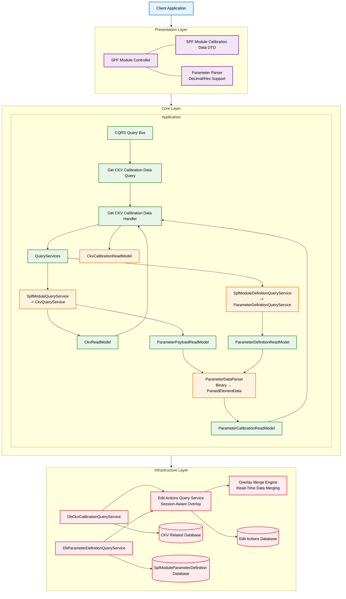
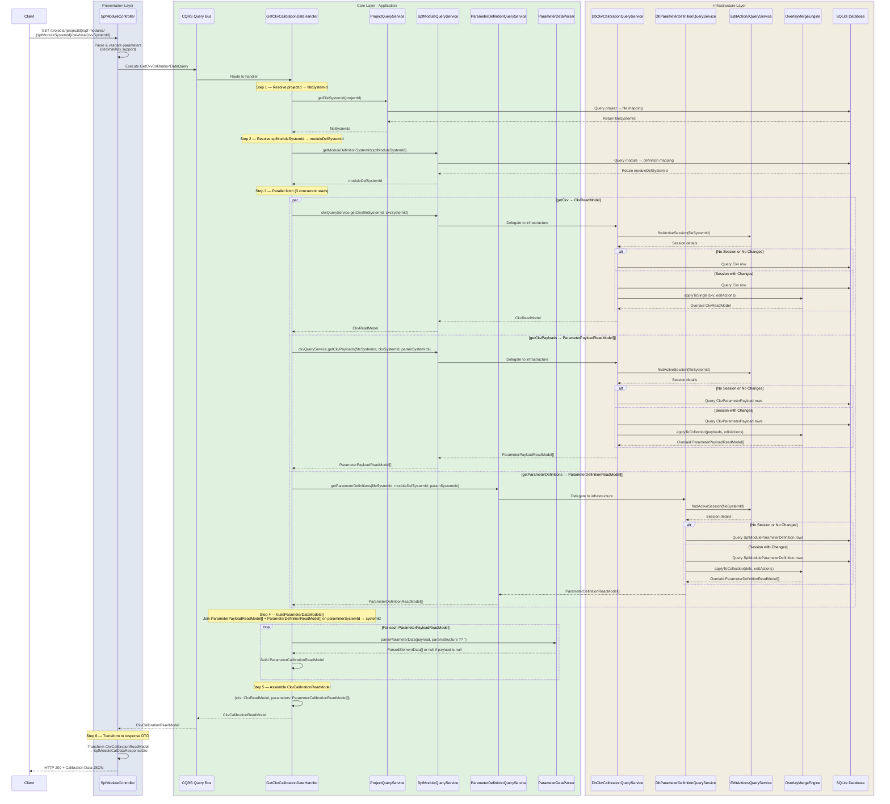
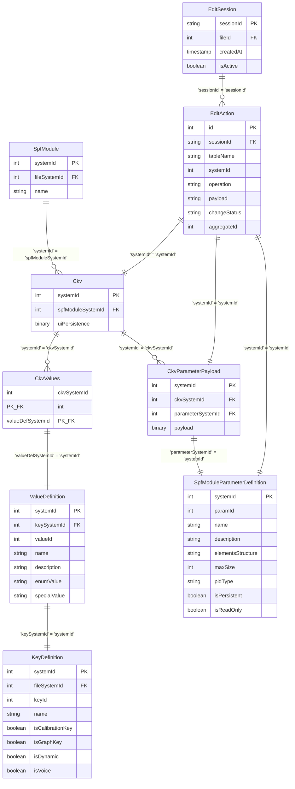

# SPF Module Get CKV Calibration Data — Low-Level Design

## Table of Contents

- [Overview](#overview)
- [High-Level Architecture Diagram](#high-level-architecture-diagram)
- [File and Folder Organization](#file-and-folder-organization)
  - [Presentation Layer Files](#presentation-layer-files)
  - [Core Layer Files](#core-layer-files)
  - [Infrastructure Layer Files](#infrastructure-layer-files)
  - [Key File Relationships](#key-file-relationships)
- [End-to-End Workflow](#end-to-end-workflow)
  - [Call Flow Summary](#call-flow-summary)
- [Layer-by-Layer Design](#layer-by-layer-design)
  - [1. Presentation Layer (API Controller)](#1-presentation-layer-api-controller)
  - [2. Core Layer (Application & Domain)](#2-core-layer-application--domain)
    - [2.1 Shared Change Vocabulary](#21-shared-change-vocabulary)
    - [2.2 Application Layer - CQRS Implementation](#22-application-layer---cqrs-implementation)
    - [2.3 Read Model Base](#23-read-model-base)
    - [2.4 CKV Calibration Read Models](#24-ckv-calibration-read-models)
    - [2.5 Binary Parameter Parser](#25-binary-parameter-parser)
      - [2.5.1 Function Interface](#251-function-interface)
      - [2.5.2 Output Type: ParsedElementData Discriminated Union](#252-output-type-parsedelementdata-discriminated-union)
      - [2.5.3 Binary Data Reader](#253-binary-data-reader)
      - [2.5.4 Formula Evaluator](#254-formula-evaluator)
  - [3. Infrastructure Layer (Database & Session Management)](#3-infrastructure-layer-database--session-management)
    - [3.1 Database Schema Relationships](#31-database-schema-relationships)
    - [3.2 DbCkvCalibrationQueryService — Service Design](#32-dbckvcalibrationqueryservice--service-design)
    - [3.3 DbParameterDefinitionQueryService — Service Design](#33-dbparameterdefinitionqueryservice--service-design)
    - [3.4 Data Transformation Pipeline](#34-data-transformation-pipeline)
- [Testing Strategy](#testing-strategy)
  - [Unit Tests](#unit-tests)
  - [Integration Tests](#integration-tests)
  - [End-to-End Tests](#end-to-end-tests)

---

## Overview

This document describes the design and implementation of the RESTful GET endpoint for retrieving SPF module CKV calibration data in the AudioReach Creator Backend system. This design covers binary parsing, session-aware overlay support, and comprehensive error handling.

**Endpoint:** `GET /arc-api/v1/projects/{projectId}/spf-modules/{spfModuleSystemId}/cal-data/{ckvSystemId}`

## High-Level Architecture Diagram



## File and Folder Organization

This section outlines the key files and their organization within the codebase that implement the `getCalibrationData` workflow. Files are annotated as **(existing)** if they already exist in the codebase or **(new)** if they are created by this feature.

### Presentation Layer Files
```
packages/api/src/presentation/rest/modules/spf-module/
├── spf-module.controller.ts                    (existing) # Main API controller — getCalibrationData method implemented here
├── dto/
│   ├── request/
│   │   ├── update-cal-data-request.dto.ts     (existing) # Request DTOs for calibration data updates
│   │   └── spf-module-request.dto.ts          (existing) # Base SPF module request DTOs
│   └── response/
│       └── spf-module-cal-data-response.dto.ts (existing) # Response DTO for calibration data

packages/api/src/presentation/rest/common/dto/
├── key-value.dto.ts                           (existing) # Key-Value pair DTOs (KeyDto, ValueDto, KeyValueDto)
├── parameter.dto.ts                           (existing) # Parameter detail DTOs
└── element-data/
    └── elements/
        ├── config-element/
        │   └── config-element.dto.ts          (existing) # ConfigElement DTO for simple data elements
        ├── element-template-array.dto.ts     (existing) # ElementTemplateArray DTO for arrays
        └── struct.dto.ts                      (existing) # Struct DTO for complex nested structures
```

### Core Layer Files
```
packages/core/src/application/
├── shared/
│   ├── change-vocabulary.ts                        (existing) # CHANGE_OPERATION, CHANGE_STATUS — ChangeInfo interface added here
│   └── read-model-base.ts                          (new)      # ReadModelBase interface
└── ports/persistence/query-services/
    ├── query-services.ts                           (existing) # QueryServices interface — spfModuleQueryService + spfModuleDefinitionQueryService added
    ├── module/                                     (existing) # ModuleQueryService
    ├── usecase/                                    (existing) # UseCaseQueryService
    ├── project/
    │   └── project-query-service.ts               (existing) # Project service for projectId → fileSystemId resolution
    ├── spf-module/
    │   ├── spf-module-query-service.ts             (new)      # SpfModuleQueryService interface
    │   └── ckv/
    │       ├── ckv-query-service.ts                (new)      # CkvQueryService interface
    │       └── ckv-read-model.ts                   (new)      # CkvReadModel, ParameterPayloadReadModel, CkvKeyReadModel, CkvValueReadModel, CkvKeyValuePairReadModel
    └── spf-module-definition/
        ├── spf-module-definition-query-service.ts  (new)      # SpfModuleDefinitionQueryService interface
        └── parameter-definition/
            ├── parameter-definition-query-service.ts (new)    # ParameterDefinitionQueryService interface
            └── parameter-definition-read-model.ts   (new)     # ParameterDefinitionReadModel interface
└── usecase-designer/
    └── spf-module/
        ├── get-cal-data/
        │   ├── get-ckv-cal-data.query.ts                (new) # GetCkvCalibrationDataQuery definition
        │   ├── get-ckv-cal-data.handler.ts              (new) # GetCkvCalibrationDataHandler
        │   └── ckv-calibration-read-model.ts            (new) # Merged application models (ParameterCalibrationReadModel, CkvCalibrationReadModel)
        └── param-parser/                            # (all files below are new)
            ├── index.ts                                 (new) # Barrel export — re-exports all public symbols from types/ and parse-elements.ts
            ├── parse-elements.ts                        (new) # parseParameterData function — entry point for binary parameter parsing
            ├── types/
            │   ├── element-definition.ts                (new) # PARAMETER_ELEMENT_TYPE, ParameterElementType, ConfigElement, StructElement, ElementArray, DefinitionElement
            │   └── parsed-element-data.ts               (new) # ParsedElementBase + ParsedElementData discriminated union (schema + data types)
            └── utils/
                ├── binary-data-reader.ts                (new) # BinaryDataReader — sequential DataView-based binary reader
                └── formular-evaluator.ts                (new) # evaluateFormula — recursive descent expression evaluator for arrayLenFormulaStr
```

### Infrastructure Layer Files
```
packages/infrastructure/persistence/src/persistence-typeorm-sqllite/
├── queries/
│   ├── typeorm-query-services.ts                          (existing) # DbQueryServices — spfModuleQueryService + spfModuleDefinitionQueryService wired here
│   ├── module-calibration/
│   │   └── db-ckv-calibration-query-service.ts           (new)      # Database implementation for CKV data with session overlay
│   ├── definition/
│   │   └── db-parameter-definition-query-service.ts      (new)      # Database implementation for parameter definitions with session overlay
│   └── edit-session/
│       ├── edit-actions-query-service.ts                 (existing) # Edit session management
│       └── overlay-merge.ts                              (existing) # Overlay merge engine (applyToSingle, applyToCollection)
└── entity-schema/
    ├── usecase-data/
    │   └── module/
    │       └── spf-module-calibration-data.schema.ts     (existing) # CkvRow, CkvParameterPayloadRow schema definitions
    └── definitions/
        ├── key-value/
        │   └── key-definition.schema.ts                  (existing) # Key-Value schema definitions
        └── module/
            └── spf/
                └── spf-module-parameter-definition.schema.ts (existing) # SpfModuleParameterDefinition schema
```

### Key File Relationships

**Request Flow:**
1. `spf-module.controller.ts` → Validates HTTP request, dispatches `GetCkvCalibrationDataQuery`
2. `query-bus.ts` → Routes query to `GetCkvCalibrationDataHandler`
3. `get-ckv-cal-data.handler.ts` → Orchestrates the workflow (resolves IDs, parallel fetch, merge, parse)
4. `db-ckv-calibration-query-service.ts` → Fetches `CkvReadModel` and `ParameterPayloadReadModel[]` with session overlay
5. `db-parameter-definition-query-service.ts` → Fetches `ParameterDefinitionReadModel[]`
6. `parse-elements.ts` (`parseParameterData`) → Decodes binary payload → `ParsedElementData[]`

**Data Flow:**
1. `CkvQueryService.getCkv()` → `CkvReadModel` (Infrastructure → Core)
2. `CkvQueryService.getCkvPayloads()` → `ParameterPayloadReadModel[]` (Infrastructure → Core)
3. `ParameterDefinitionQueryService.getParameterDefinitions()` → `ParameterDefinitionReadModel[]` (Infrastructure → Core)
4. `parseParameterData()` → `ParsedElementData[]` (binary decode)
5. `buildParameterDataModels()` → `ParameterCalibrationReadModel[]` (merge + parse)
6. `GetCkvCalibrationDataHandler` → `CkvCalibrationReadModel` (final output, Core → Presentation)
7. Controller → `SpfModuleCalDataResponseDto` (DTO transformation, Presentation)

**Session Management:**
- `edit-actions-query-service.ts` → Manages active editing sessions
- `overlay-merge.ts` → Merges pending changes with base data at read time
- `CkvReadModel` and `ParameterPayloadReadModel[]` are both subject to session overlay

## End-to-End Workflow

### Call Flow Summary

The SPF Module Get Calibration Data endpoint follows a structured workflow orchestrated by `GetCkvCalibrationDataHandler`:

1. **Request Processing**: The API controller validates parameters and dispatches a `GetCkvCalibrationDataQuery` through the CQRS Query Bus.
2. **Project & Module Resolution**: The handler resolves `projectId` → `fileSystemId` (via `ProjectQueryService`) and `spfModuleSystemId` → `moduleDefSystemId` (via `SpfModuleQueryService`).
3. **Parallel Data Fetch**: Three reads are issued concurrently:
   - `CkvQueryService.getCkv()` → `CkvReadModel` (CKV row with key-value pairs and `uiPersistence`)
   - `CkvQueryService.getCkvPayloads()` → `ParameterPayloadReadModel[]` (one row per parameter: binary payload)
   - `ParameterDefinitionQueryService.getParameterDefinitions()` → `ParameterDefinitionReadModel[]` (one row per parameter: schema metadata)
4. **Binary Parsing & Merge**: `buildParameterDataModels()` joins `ParameterPayloadReadModel[]` with `ParameterDefinitionReadModel[]` on `parameterSystemId` → `systemId`, decodes each binary payload via `parseParameterData()`, and produces `ParameterCalibrationReadModel[]`.
5. **Output Assembly**: The handler wraps `CkvReadModel` + `ParameterCalibrationReadModel[]` into `CkvCalibrationReadModel` and returns it to the controller.
6. **Response Transformation**: The controller transforms `CkvCalibrationReadModel` into `SpfModuleCalDataResponseDto` (mapping `ParsedElementData[]` → element DTOs) and returns HTTP 200.

All three data reads in step 3 go through the Infrastructure Layer with session-aware overlay support:
- **Read-Only Mode**: Direct database queries when no active editing session exists
- **Session with No Changes**: Skip overlay processing when session exists but no pending changes
- **Session with Changes**: Full overlay processing to merge pending edits with base data



## Layer-by-Layer Design

### 1. Presentation Layer (API Controller)

**File:** `packages/api/src/presentation/rest/modules/spf-module/spf-module.controller.ts` (existing)

#### Responsibilities:
- HTTP request handling and parameter validation
- Authentication and authorization (JWT Guard)
- Parameter parsing (decimal/hexadecimal support with 0x prefix)
- CQRS query orchestration
- Complex DTO transformation with structured element support
- Comprehensive error handling and HTTP status code mapping

#### Key Components:

```typescript
@Get('/:spfModuleSystemId/cal-data/:ckvSystemId')
async getCalibrationData(
  @Param('projectId') projectId: string,
  @Param('spfModuleSystemId') spfModuleSystemId: string,
  @Param('ckvSystemId') ckvSystemId: string,
  @Query('param-system-ids') paramSystemIds?: string,
): Promise<ApiResult<SpfModuleCalDataResponseDto>>
```

#### Parameter Processing:
- **Path Parameters:** projectId, spfModuleSystemId, ckvSystemId — passed as raw strings directly to `GetCkvCalibrationDataQuery`
- **Query Parameters:** param-system-ids (optional, comma-separated string) — passed as-is to `GetCkvCalibrationDataQuery`
- **Parsing & Validation:** Performed inside `GetCkvCalibrationDataQuery` constructor via a file-private `parseId()` helper. Supports decimal and `0x`/`0X` hexadecimal notation. Throws `InvalidParameterError` (ERR_1004) if any value is invalid.
- **Error Handling:** Controller catches `InvalidParameterError` → HTTP 400; `EntityNotFoundError` → HTTP 404; `ParameterDefinitionMissingError` → HTTP 500; generic fallback → HTTP 422

#### DTO Transformation Logic:
```typescript
private transformToCalibrationDataDto(
  model: CkvCalibrationReadModel,
): SpfModuleCalDataResponseDto {
  // Transform CkvReadModel → CKV DTO (keyValuePairs, uiPersistence, changeInfo)
  // Transform ParameterCalibrationReadModel[] → ParameterDetailDto[]
  //   For each parameter, transform ParsedElementData[] → element DTOs:
  //     PARAMETER_ELEMENT_TYPE.ConfigElement  → ConfigElementDto  (value, dataType, ranges, etc.)
  //     PARAMETER_ELEMENT_TYPE.ElementArray   → ElementArrayDto   (template, length, lengthFormula, value[])
  //     PARAMETER_ELEMENT_TYPE.Struct         → StructDto         (children recursively transformed)
  //   If parsedData is null → omit or return empty elements array
  //   If parsedData[0].name === '_raw' → surface as raw hex fallback element
}
```

#### Structured Element Transformation:
- **`PARAMETER_ELEMENT_TYPE.ConfigElement`:** Single scalar value — maps to `ConfigElementDto` with `value`, `dataType`, `min`, `max`, `unit`, etc.
- **`PARAMETER_ELEMENT_TYPE.ElementArray`:** Fixed or dynamic-length array — maps to `ElementArrayDto` with `template`, `length`, `lengthFormula`, and `value[]` (parsed items)
- **`PARAMETER_ELEMENT_TYPE.Struct`:** Named group of child elements — maps to `StructDto` with recursively transformed children
- **Parse failure (`_raw`):** When `parsedData[0].name === '_raw'`, the controller surfaces the hex string as an opaque fallback element

### 2. Core Layer (Application & Domain)

#### 2.1 Shared Change Vocabulary

**File:** `packages/core/src/application/shared/change-vocabulary.ts` (existing — `ChangeInfo` interface added)

This file defines the shared vocabulary for tracking changes across the application layer. It exports the `CHANGE_OPERATION` const object, the `CHANGE_STATUS` const object, and the `ChangeInfo` interface.

```typescript
// Existing exports (unchanged)
export const CHANGE_OPERATION = {
  None: 'NONE',
  Create: 'CREATE',
  Update: 'UPDATE',
  Delete: 'DELETE',
} as const;
export type ChangeOperation = (typeof CHANGE_OPERATION)[keyof typeof CHANGE_OPERATION];

export const CHANGE_STATUS = {
  Staged: 'STAGED',
  Unstaged: 'UNSTAGED',
} as const;
export type ChangeStatus = (typeof CHANGE_STATUS)[keyof typeof CHANGE_STATUS];

// New addition
export interface ChangeInfo {
  changeType: ChangeOperation;   // NONE | CREATE | UPDATE | DELETE
  changeId?: number;             // The edit_actions.change_id — present when changeType != NONE
  changeStatus?: ChangeStatus;   // STAGED | UNSTAGED — present when changeType != NONE
}
```

**Design Notes:**
- `changeType` is always present and uses `'NONE'` to indicate no pending change.
- `changeId` and `changeStatus` are optional and only meaningful when `changeType !== 'NONE'`; they map directly to the `edit_actions` table columns `change_id` and `change_status`.
- `ChangeInfo` is intended to replace ad-hoc `editStatus` fields in domain models, providing a single, consistent shape for change-tracking metadata throughout the application layer.

#### 2.2 Application Layer - CQRS Implementation

**Query Services:**

**File:** `packages/core/src/application/ports/persistence/query-services/query-services.ts` (existing — two new services added)

```typescript
export interface QueryServices {
  // Existing services (unchanged)
  readonly useCaseQueryService: UseCaseQueryService;
  readonly projectQueryService: ProjectQueryService;
  readonly validationQueryService: ValidationQueryRepository;
  // New services added for this feature
  readonly spfModuleQueryService: SpfModuleQueryService;
  readonly spfModuleDefinitionQueryService: SpfModuleDefinitionQueryService;
}
```

**File:** `packages/core/src/application/ports/persistence/query-services/spf-module/spf-module-query-service.ts` (new)

```typescript
export interface SpfModuleQueryService {
  getModuleDefinitionSystemId(spfModuleSystemId: number): Promise<number>;
  readonly ckvQueryService: CkvQueryService;
  // future: properties, tags, summary, etc.
}
```

**File:** `packages/core/src/application/ports/persistence/query-services/spf-module-definition/spf-module-definition-query-service.ts` (new)

```typescript
export interface SpfModuleDefinitionQueryService {
  readonly parameterDefinitionQueryService: ParameterDefinitionQueryService;
  // future: module definition summary, port definitions, etc.
}
```

**File:** `packages/core/src/application/ports/persistence/query-services/spf-module/ckv/ckv-query-service.ts` (new)

```typescript
export interface CkvQueryService {
  getCkv(
    fileSystemId: number,
    ckvSystemId: number
  ): Promise<CkvReadModel | null>;

  getCkvPayloads(
    fileSystemId: number,
    ckvSystemId: number,
    paramSystemIds?: number[], //paramSystemIds is optional. If it is provided, should return payloads for these paramSystemIds under ckvSystemId. Otherwise, return all payloads under ckvSystemId.
  ): Promise<ParameterPayloadReadModel[]>;
}
```

**File:** `packages/core/src/application/ports/persistence/query-services/spf-module-definition/parameter-definition/parameter-definition-query-service.ts` (new)

```typescript
export interface ParameterDefinitionQueryService {
  getParameterDefinitions(
    fileSystemId: number,
    moduleDefSystemId: number,
    paramSystemIds?: number[] //paramSystemIds is optional. If it is provided, should return definitions for these paramSystemIds under moduleDefSystemId. Otherwise, return all definitions under moduleDefSystemId.
  ): Promise<ParameterDefinitionReadModel[]>;
}
```

**File:** `packages/core/src/application/usecase-designer/spf-module/get-cal-data/get-ckv-cal-data.query.ts` (new)

**Query Definition:**

All ID parameters are accepted as raw strings and parsed to integers inside the constructor. A file-private `parseId()` helper (not exported) handles decimal and `0x`-prefixed hexadecimal notation. Throws `InvalidParameterError` (ERR_1004) on any invalid value — the controller catches this and maps it to HTTP 400.

```typescript
export class GetCkvCalibrationDataQuery extends BaseQuery {
  public readonly projectId: number;
  public readonly spfModuleSystemId: number;
  public readonly ckvSystemId: number;
  public readonly paramSystemIds?: number[];

  constructor(
    projectIdStr: string,
    spfModuleSystemIdStr: string,
    ckvSystemIdStr: string,
    clientId: string,
    /** Optional comma-separated list of parameter system IDs (decimal or hex). */
    paramSystemIdsStr?: string,
  )
}
```

**File:** `packages/core/src/application/usecase-designer/spf-module/get-cal-data/get-ckv-cal-data.handler.ts` (new)

**Query Handler: `GetCkvCalibrationDataHandler`**

`GetCkvCalibrationDataHandler` handles exactly one query type (`GetCkvCalibrationDataQuery`). It is the orchestrator for the get-CKV-calibration-data use case. It resolves all required data in parallel, delegates binary parsing to `ParameterDataParser`, and returns a fully merged `CkvCalibrationReadModel` to the controller. It never touches the database directly — all data access goes through `QueryServices`.

**Responsibilities:**
- Resolve `projectId` → `fileSystemId` via `ProjectQueryService`
- Resolve `spfModuleSystemId` → `moduleDefSystemId` via `SpfModuleQueryService`
- Fetch CKV data, parameter payloads, and parameter definitions in parallel
- Merge payloads + definitions into `ParameterCalibrationReadModel[]` via `buildParameterDataModels`
- Throw `EntityNotFoundError` if the CKV does not exist

```typescript
export class GetCkvCalibrationDataHandler
  implements QueryHandler<GetCkvCalibrationDataQuery, CkvCalibrationReadModel> {

  constructor(private readonly queryServices: QueryServices) {}

  async handle(query: GetCkvCalibrationDataQuery): Promise<CkvCalibrationReadModel> {
    // Step 1: Resolve projectId → fileSystemId (number)
    // Used to scope all subsequent DB queries to the correct file
    const fileSystemId = await this.queryServices.projectQueryService
      .getFileSystemId(query.projectId);

    // Step 2: Resolve spfModuleSystemId → moduleDefSystemId (number)
    // The module definition systemId is needed to fetch ParameterDefinitionReadModel[]
    const moduleDefSystemId = await this.queryServices.spfModuleQueryService
      .getModuleDefinitionSystemId(query.spfModuleSystemId);

    // Step 3: Fetch in parallel:
    //   ckv                 → CkvReadModel | null
    //                          (CKV row with uiPersistence + KeyValuePairReadModel[])
    //   payloads            → ParameterPayloadReadModel[]
    //                          (one row per parameter: parameterSystemId, payload)
    //   parameterDefinitions → ParameterDefinitionReadModel[]
    //                          (one row per parameter: name, paramStructure, defaultData, etc.)
    const [ckv, payloads, parameterDefinitions] = await Promise.all([
      this.queryServices.spfModuleQueryService.ckvQueryService.getCkv(fileSystemId, query.ckvSystemId),
      this.queryServices.spfModuleQueryService.ckvQueryService.getCkvPayloads(fileSystemId, query.ckvSystemId, query.paramSystemIds),
      this.queryServices.spfModuleDefinitionQueryService.parameterDefinitionQueryService
        .getParameterDefinitions(fileSystemId, moduleDefSystemId, query.paramSystemIds),
    ]);

    if (!ckv) throw new EntityNotFoundError('Ckv', query.ckvSystemId);

    // Step 4: Merge payloads + definitions → ParameterCalibrationReadModel[]
    //         and assemble the final CkvCalibrationReadModel
    return { ckv, parameters: this.buildParameterDataModels(payloads, parameterDefinitions) };
  }
}
```

> **Note:** `GetCkvCalibrationDataHandler` implements `QueryHandler<GetCkvCalibrationDataQuery, CkvCalibrationReadModel>` — one handler, one query type — and returns `CkvCalibrationReadModel` as the final merged output type (see section 2.4).

**Merge & Parse: `buildParameterDataModels`**

This private method is the merge point between the two DB read models and the binary parser. It joins `ParameterPayloadReadModel[]` (payload rows) with `ParameterDefinitionReadModel[]` (schema metadata) on `parameterSystemId` → `systemId`, decodes each binary payload using `parseParameterData()` (see **section 2.5 Binary Parameter Parser**), and returns `ParameterCalibrationReadModel[]`.

```typescript
  private buildParameterDataModels(
    payloads: ParameterPayloadReadModel[],
    definitions: ParameterDefinitionReadModel[],
  ): ParameterCalibrationReadModel[] {
    // Key the definition map by systemId (PK of SpfModuleParameterDefinition)
    // so it aligns with parameterSystemId (FK) on each payload row.
    const defMap = new Map(definitions.map(d => [d.systemId, d]));

    return payloads.map(p => {
      const def = defMap.get(p.parameterSystemId);

      // A non-null payload without a definition is a FK integrity violation —
      // surface it as an explicit error rather than silently returning null.
      if (p.payload !== null && def === undefined) {
        throw new ParameterDefinitionMissingError(p.parameterSystemId);
      }

      const parsedData: ParsedElementData[] | null =
        p.payload !== null && def !== undefined
          ? parseParameterData(p.payload, def.paramStructure)
          : null;
      // If p.payload is null → parsedData stays null (upper layer knows no payload is stored)

      return {
        parameterSystemId: p.systemId,
        changeInfo: p.changeInfo,
        parameterId: def?.parameterId ?? 0,  // business key from the definition
        name: def?.name ?? '',
        description: def?.description,
        isReadOnly: def?.isReadOnly ?? false,
        isHidden: def?.isHidden,
        pidType: def?.pidType ?? '',
        parsedData,
      };
    });
  }
```

**Design Notes:**
1. **Join by `parameterSystemId`** — builds an O(1) lookup map from `definitions` keyed by `d.systemId` (PK of `SpfModuleParameterDefinition`), then looks up each payload by `p.parameterSystemId` (FK). This is the correct FK → PK join.
2. **Payload absent (`null`)** — if `p.payload` is `null`, `parsedData` stays `null` and the upper layer knows no binary data is stored for this CKV parameter.
3. **Payload present, definition missing** — `CkvParameterPayload.parameterSystemId` is a FK to `SpfModuleParameterDefinition`. A non-null payload without a matching definition is a database integrity violation. `buildParameterDataModels` throws `ParameterDefinitionMissingError(p.parameterSystemId)` (error code `ERR_4005`) rather than silently returning `null`, which would be indistinguishable from a legitimately absent payload. The controller catches this error and maps it to HTTP 500.
4. **Binary parsing** — if `p.payload` is not null and `def` is present, calls `parseParameterData(p.payload, def.paramStructure)`.
5. **Parse failure fallback** — `parseParameterData` handles all parse errors internally (malformed `paramStructure` JSON, buffer overflow, unknown element type) and always returns a valid `ParsedElementData[]`. On failure it returns `[{ type: 'ConfigElement', name: '_raw', isReadOnly: true, value: <hexString> }]`. The handler calls it without a try/catch and always receives a uniform array with no branching needed.
6. **Output** — returns `ParameterCalibrationReadModel[]` combining definition metadata (`name`, `description`, `isReadOnly`, `isHidden`, `pidType`) with the decoded `parsedData`, ready for the controller to transform into response DTOs.
7. **TODO (future) — PID policy validation** — Currently, PID policy for CKV does not exist in the database. In the future, a new table may be added to hold PID policy per CKV. Once that table exists, `GetCkvCalibrationDataHandler` should also query the PID policy for the CKV (in parallel with the existing three reads). Before calling `buildParameterDataModels`, the handler should validate the PID policy against the parameter payloads. If the PID policy does not match a parameter's payload, that parameter should still be included in the response but surfaced as a warning via `ApiResult.warnings` rather than silently dropped or treated as an error.

#### 2.3 Read Model Base

**File:** `packages/core/src/application/shared/read-model-base.ts` (new)

Base interface for all read models that represent a DB row. Any entity that has its own row in the database (including definitions such as `SpfModuleParameterDefinition` and `SpfModuleDefinition`) has its read model extend `ReadModelBase`.

```typescript
/**
 * Base interface for all read models that represent a DB row.
 *
 * Rule: if an entity has its own row in the database, its read model
 * extends ReadModelBase. This includes definitions (SpfModuleParameterDefinition,
 * SpfModuleDefinition) — they can be updated when a new module version is imported.
 *
 * changeInfo carries the change vocabulary from the active edit session overlay.
 * When no session is active, changeType is always NONE.
 */
export interface ReadModelBase {
  readonly systemId: number;
  readonly changeInfo: ChangeInfo;
}
```

**Design Notes:**
- `systemId` is typed as `number` to match the integer primary keys used throughout the database schema.
- `changeInfo` is always present; when no edit session is active, `changeInfo.changeType` is `'NONE'`.
- Extending `ReadModelBase` makes the change-tracking contract explicit and uniform across all read models.

#### 2.4 CKV Calibration Read Models

**File:** `packages/core/src/application/ports/persistence/query-services/spf-module/ckv/ckv-read-model.ts` (new)

```typescript
// --- DB read models (inputs to handler, not returned to upper layer) ---

// CKV row
export interface CkvReadModel extends ReadModelBase {
  // changeType: NONE | CREATE | UPDATE (UPDATE = uiPersistence changed)
  spfModuleSystemId: number;
  uiPersistence: Uint8Array | null;
  keyValuePairs: KeyValuePairReadModel[];
}

// Parameter payload row
export interface ParameterPayloadReadModel extends ReadModelBase {
  // changeType: NONE | CREATE | UPDATE (UPDATE = binary payload changed)
  // parameterSystemId is the FK to SpfModuleParameterDefinition.systemId — used as join key
  parameterSystemId: number;
  payload: Uint8Array | null;
}

// Key definition row — name can change in session
export interface KeyReadModel extends ReadModelBase {
  keyId: number;
  name: string;
}

// Value definition row — name can change in session
export interface ValueReadModel extends ReadModelBase {
  valueId: number;
  name: string;
}

export interface KeyValuePairReadModel {
  key: KeyReadModel;
  value: ValueReadModel;
  // The key-value pair itself is the natural key of a CKV and never changes.
  // Only the display names (key.name, value.name) can change via session edits.
}
```

**File:** `packages/core/src/application/ports/persistence/query-services/spf-module-definition/parameter-definition/parameter-definition-read-model.ts` (new)

```typescript
// Parameter definition row
export interface ParameterDefinitionReadModel extends ReadModelBase {
  // changeType: NONE | UPDATE (when module definition is re-imported)
  readonly systemId: number;  // PK of SpfModuleParameterDefinition — join target for ParameterCalibrationReadModel.parameterSystemId
  parameterId: number;        // maps from SpfModuleParameterDefinitionRow.paramId
  name: string;
  description?: string;
  paramStructure: string;    // JSON string — maps from SpfModuleParameterDefinitionRow.elementsStructure
  isReadOnly: boolean;
  pidType: string;
}
```

**File:** `packages/core/src/application/usecase-designer/spf-module/get-cal-data/ckv-calibration-read-model.ts` (new)

```typescript
// --- Merged application model (produced by handler, returned to upper layer) ---

// Result of merging ParameterPayloadReadModel + ParameterDefinitionReadModel
export interface ParameterCalibrationReadModel {
  parameterSystemId: number;
  changeInfo: ChangeInfo;
  parameterId: number;
  name: string;
  description?: string;
  isReadOnly: boolean;
  isHidden?: boolean;
  pidType: string;
  // null when p.payload is null (no binary data stored for this CKV parameter)
  // non-null array when p.payload exists (parsed result, or _raw fallback if paramStructure is missing/invalid)
  parsedData: ParsedElementData[] | null;
}

// --- Final return type of GetCkvCalibrationDataHandler ---

export interface CkvCalibrationReadModel {
  ckv: CkvReadModel;
  parameters: ParameterCalibrationReadModel[];  // merged, not raw DB rows
}
```

**Why `ParameterCalibrationReadModel` is needed?**
`ParameterPayloadReadModel` (DB read model) carries only the raw binary `payload` and a foreign key (`parameterSystemId`). `ParameterDefinitionReadModel` (DB read model) carries the schema metadata (`name`, `description`, `paramStructure`, `defaultData`, etc.) but no calibration value. Neither alone is sufficient for the upper layer. The handler merges them — joining on `parameterSystemId` → `systemId` and parsing the binary payload using `paramStructure` as the schema — to produce `ParameterCalibrationReadModel`, which contains both definition metadata and decoded calibration values in a single type ready for the controller to transform into a response DTO.

**Why `ParsedElementData[]` instead of a raw JSON string?**
`parsedData` is the result of binary parsing — it is already a structured TypeScript object. Storing it as a JSON string would require `JSON.parse()` at every consumer, lose all type safety, and embed a string-within-JSON in the HTTP response (a double-encoding anti-pattern). `ParsedElementData[]` gives the controller full typed access to individual fields (`value`, `type`, `name`, etc.) for DTO transformation, and is serialized to JSON automatically when the HTTP response is built.

#### 2.5 Binary Parameter Parser

**File:** `packages/core/src/application/usecase-designer/spf-module/param-parser/parse-elements.ts` (new)

**Responsibilities:**
- Parse a binary `payload` (or `defaultData` fallback) into `ParsedElementData[]` using `paramStructure` (JSON string) as the schema.
- On parse failure, return a single opaque `ConfigElement` whose `value` is the hex string of the payload bytes, so the upper layer always receives a valid `ParsedElementData[]` with no special handling required.

**Key Features:**
- **Structure-Driven Parsing:** Uses `paramStructure` (JSON) to know the field layout of the binary data
- **Type Safety:** Comprehensive data type support (UInt8/16/32, Int8/16/32, Float, Double, RawData)
- **Complex Structures:** Support for nested structs, arrays, and dynamic arrays
- **Binary Reader:** Efficient DataView-based binary parsing with overflow protection
- **Parse Failure Fallback:** On error, returns `[{ type: 'ConfigElement', name: '_raw', isReadOnly: true, value: <hexString> }]` instead of throwing — the controller needs no special handling

##### 2.5.1 Function Interface

```typescript
/**
 * Parse binary parameter data using the parameter definition structure.
 * @param payload        - Binary data to parse
 * @param paramStructure - JSON string describing the field layout (validated in DB layer)
 * @returns ParsedElementData[] — one entry per top-level element in the structure.
 *          On any error, returns a single opaque ConfigElement with
 *          name '_raw' and value set to the hex string of the payload bytes.
 */
export function parseParameterData(
  payload: Uint8Array,
  paramStructure: string,
): ParsedElementData[] {
  try {
    // paramStructure is validated in the DB layer before being stored;
    // cast directly to DefinitionElement[] without re-validating.
    const definitions = JSON.parse(paramStructure) as DefinitionElement[];
    const reader = new BinaryDataReader(payload);
    const parsed: ParsedElementData[] = [];
    for (const element of definitions) {
      parsed.push(parseElement(element, reader, parsed));
    }
    return parsed;
  } catch {
    return [rawFallback(payload)];
  }
}
```

**What `parseParameterData` does:**
1. Calls `JSON.parse(paramStructure)` and casts directly to `DefinitionElement[]`. No Zod re-validation is performed — `paramStructure` is validated by the DB layer before storage.
2. Creates a `BinaryDataReader` wrapping `payload`.
3. Iterates over each definition element and dispatches to the appropriate private parser based on `elementType`:
   - `parseConfigElement` — reads a single scalar value from the reader based on `dataType` (UInt8/16/32, Int8/16/32, Float, Double, RawData) and returns a `ConfigElementData`.
   - `parseStruct` — recursively parses each child element in `elements` and returns a `StructData`.
   - `parseElementArray` — evaluates `arrayLenFormulaStr` or uses `arrayLength` to determine item count; for each item, parses it according to `template`; returns an `ElementArrayData` with `value: ParsedElementData[]`. When a template element has no `name`, the parser assigns a generated name: the `ElementArray`'s own `name` for the template schema (e.g., `"filter_coeffs"`), and `"<arrayName>[<index>]"` for each parsed item (e.g., `"filter_coeffs[0]"`).
4. Returns the collected `ParsedElementData[]`.
5. If any step throws (malformed JSON, buffer overflow), the catch block returns `[{ type: 'ConfigElement', name: '_raw', isReadOnly: true, value: <hexString> }]` so the caller always receives a valid array.

**Supported Element Types (`elementType` in `paramStructure` JSON):**
- `ConfigElement` → scalar value (UInt8/16/32, Int8/16/32, Float, Double, RawData); `name` is optional for template elements inside `ElementArray`
- `Struct` → named group of child elements (recursive); each child is a `DefinitionElement`
- `ElementArray` → array of items, each item described by `template.elements` (a mixed list of `ConfigElement`, `Struct`, and nested `ElementArray`); length driven by `arrayLength` (static) or `arrayLenFormulaStr` (dynamic formula)

##### 2.5.2 Output Type: `ParsedElementData` Discriminated Union

**File:** `packages/core/src/application/usecase-designer/spf-module/param-parser/types/parsed-element-data.ts` (new)

**`PARAMETER_ELEMENT_TYPE` const** — defined in `types/element-definition.ts` as the single source of truth for the `elementType` discriminator values used in both the DB-layer JSON schema and the `ParsedElementData` type fields:

```typescript
// packages/core/src/application/usecase-designer/spf-module/param-parser/types/element-definition.ts
export const PARAMETER_ELEMENT_TYPE = {
  ConfigElement: 'ConfigElement',
  Struct: 'Struct',
  ElementArray: 'ElementArray',
} as const;
```

The `DefinitionElement` interfaces (`ConfigElement`, `StructElement`, `ElementArray`) that describe the DB-layer JSON structure are exported from `types/element-definition.ts` and imported by `parse-elements.ts`. `ParsedElementBase` is defined and exported from `types/parsed-element-data.ts`.


Two separate type families are defined: `ParsedElementSchema` for schema descriptors (used in `template`) and `ParsedElementData` for parsed results (value fields required). This split gives the TypeScript compiler full precision — it is impossible to accidentally use a schema descriptor where a parsed result is expected, and vice versa.

```typescript
// ── Shared base fields present on every element variant ──────────────────────
interface ParsedElementBase {
  name: string;
  description?: string;
  group?: string;
  subgroup?: string;
  isReadOnly: boolean;
}

// ════════════════════════════════════════════════════════════════════════════
// SCHEMA TYPES — no value field; used for ElementTemplateArrayData.template
// ════════════════════════════════════════════════════════════════════════════

// ── ConfigElementSchema ───────────────────────────────────────────────────────
// Schema descriptor for a scalar element — carries display/constraint metadata
// but no actual value. Used as template for ConfigElementArray items.
export interface ConfigElementSchema extends ParsedElementBase {
  type: typeof PARAMETER_ELEMENT_TYPE.ConfigElement;  // 'ConfigElement'
  dataType: string;                    // e.g. 'UInt8', 'Float', 'Double' — required for UI rendering
  unit?: string;                       // unitStr
  displayType?: string;                // e.g. 'hex', 'decimal'
  policy?: string;
  qFormat?: string;                    // Q-format notation for fixed-point values
  precision?: number;                  // Decimal precision for display
  defaultValue?: string;               // default value as string
  min?: string;                        // min value as string (may be hex, e.g. "0x00000000")
  max?: string;                        // max value as string (may be hex, e.g. "0xFFFFFFFF")
  rangeList?: Array<{ name: string; value: string }>;  // named value list (e.g. enum-like options)
  dependentOnElements?: Array<{ name: string }>;       // elements that depend on this element's value (e.g. for array length formulas)
}

// ── StructSchema ──────────────────────────────────────────────────────────────
// Schema descriptor for a struct — carries structureType and child schemas but no actual values.
// structureType is the C type struct name (e.g. 'limiter_config_param_t'),
// which may differ from the element's name (e.g. 'limiter').
export interface StructSchema extends ParsedElementBase {
  type: typeof PARAMETER_ELEMENT_TYPE.Struct;  // 'Struct'
  structureType: string;               // C type struct name (required)
  children: ParsedElementSchema[];     // Child element schemas (no values)
}

// ── ElementArraySchema ────────────────────────────────────────────────────────
// Schema descriptor for a nested ElementArray — carries template + length info
// but no actual values. Used as template when an ElementArray contains nested ElementArrays.
export interface ElementArraySchema extends ParsedElementBase {
  type: typeof PARAMETER_ELEMENT_TYPE.ElementArray;  // 'ElementArray'
  template: ParsedElementSchema;  // schema of one item with default value
  length?: number;                // static array length (arrayLength)
  arrayLenFormulaStr?: string;    // dynamic length formula
}

// ── Schema union ──────────────────────────────────────────────────────────────
export type ParsedElementSchema = ConfigElementSchema | StructSchema | ElementArraySchema;

// ════════════════════════════════════════════════════════════════════════════
// DATA TYPES — value required; output of parseParameterData
// ════════════════════════════════════════════════════════════════════════════

// ── ConfigElementData ─────────────────────────────────────────────────────────
// Produced by: parseConfigElement (elementType = 'ConfigElement')
// Extends ConfigElementSchema — adds required value read from binary payload.
// value is always a string — the parser calls .toString() on every numeric read
// (UInt8/16/32, Int8/16/32, Float, Double) and Array.from().toString() for RawData.
export interface ConfigElementData extends ConfigElementSchema {
  value: string;   // required — always set by parser
}

// ── ElementArrayData ──────────────────────────────────────────────────────────
// Produced by: parseElementArray (elementType = 'ElementArray')
// Represents a fixed or dynamic-length array of items.
//
// template is a ParsedElementSchema — schema of one item (no value).
// Each item can be a ConfigElement, Struct, or nested ElementArray.
// Always present even when value = [] so consumers know the item schema.
// The UI uses template as the blueprint when adding a new entry to a dynamic array.
//
// value holds the parsed items (required; empty [] when length = 0).
// Each value[i] is one parsed item (ConfigElementData, StructData, or ElementArrayData).
// length is the resolved array length (static arrayLength or formula-evaluated).
// arrayLenFormulaStr is present only for dynamic arrays; absent for static arrays.
export interface ElementArrayData extends ParsedElementBase {
  type: typeof PARAMETER_ELEMENT_TYPE.ElementArray;  // 'ElementArray'
  // template holds the original element definition from paramStructure JSON (e.g. ConfigElementSchema
  // with dataType, defaultValue, min, max, rangeList, etc., or StructSchema with children, or a nested
  // ElementArraySchema). It carries no parsed value — it is the schema descriptor as-is from the
  // parameter definition, preserved so the UI can render the correct input control and constraints
  // when adding a new entry to a dynamic array.
  template: ParsedElementSchema;
  value: ParsedElementData[];     // Parsed items; each entry is one item; empty [] when length = 0
  length: number;                 // Actual array length
  arrayLenFormulaStr?: string;    // Formula expression for dynamic arrays; absent for static arrays
}

// ── StructData ────────────────────────────────────────────────────────────────
// Produced by: parseStruct (elementType = 'Struct')
// Represents a named group of child elements parsed recursively.
// isReadOnly is always false at the struct level; read-only status is per-child.
export interface StructData extends ParsedElementBase {
  type: typeof PARAMETER_ELEMENT_TYPE.Struct;  // 'Struct'
  structureType: string;       // C type struct name (required)
  value: ParsedElementData[];  // Recursively parsed child elements (required; always non-empty)
}

// ── Data union ────────────────────────────────────────────────────────────────
export type ParsedElementData = ConfigElementData | StructData | ElementArrayData;
```

**Type summary:**

| Type family | Types | `value` field | Used for |
|---|---|---|---|
| `ParsedElementSchema` | `ConfigElementSchema`, `StructSchema`, `ElementArraySchema` | absent | `ElementArrayData.template`; `StructSchema.children`; `ElementArraySchema.template` |
| `ParsedElementData` | `ConfigElementData`, `StructData`, `ElementArrayData` | required | Output of `parseParameterData`; `StructData.value`; `ElementArrayData.value` |

**`value` field by `ParsedElementData` variant:**

| `type` | `value` TypeScript type | Content |
|---|---|---|
| `PARAMETER_ELEMENT_TYPE.ConfigElement` (`'ConfigElement'`) | `string` (required) | Scalar numeric value converted to string via `.toString()` |
| `PARAMETER_ELEMENT_TYPE.Struct` (`'Struct'`) | `ParsedElementData[]` (required) | Recursively parsed child elements; always non-empty |
| `PARAMETER_ELEMENT_TYPE.ElementArray` (`'ElementArray'`) | `ParsedElementData[]` (required) | Parsed items; each entry is one item (`ConfigElementData`, `StructData`, or `ElementArrayData`); empty `[]` when length = 0 |


##### 2.5.3 Binary Data Reader

**File:** `packages/core/src/application/usecase-designer/spf-module/param-parser/utils/binary-data-reader.ts` (new)

```typescript
export class BinaryDataReader {
  constructor(data: Uint8Array);
  readUInt8(): number;
  readUInt16(): number;
  readUInt32(): number;
  readUInt64(): bigint;
  readInt8(): number;
  readInt16(): number;
  readInt32(): number;
  readInt64(): bigint;
  readFloat(): number;
  readDouble(): number;
  readRawData(length: number): Uint8Array;
  getRemainingBytes(): number;
  align(alignment: number): void;
  // All read methods throw on buffer overflow
}
```

##### 2.5.4 Formula Evaluator

**File:** `packages/core/src/application/usecase-designer/spf-module/param-parser/utils/formular-evaluator.ts` (new)

Recursive descent expression evaluator used by `ParameterDataParser` to resolve `arrayLenFormulaStr` into a concrete array length at parse time.

**Supported syntax:**
- Arithmetic operators: `+`, `-`, `*`, `/`
- Grouping: `(expr)` or `[expr]`
- Unary minus: `-expr`
- Integer and decimal literals: `42`, `3.14`
- Variables: identifiers resolved from previously parsed `ConfigElement` values by name
- Built-in constants: `e` (Euler's number), `pi`
- Functions: `log(x)` (base-10), `ln(x)` (natural log), `sqrt(x)`

Throws on any parse or evaluation error (unknown variable, division by zero, syntax error). Callers that need a `0` fallback should wrap in try/catch.

```typescript
export function evaluateFormula(
  formula: string,
  variables: Map<string, number>,
): number
```

### 3. Infrastructure Layer (Database & Session Management)

#### 3.1 Database Schema Relationships



#### 3.2 `DbCkvCalibrationQueryService` — Service Design

**File:** `packages/infrastructure/persistence/src/persistence-typeorm-sqllite/queries/module-calibration/db-ckv-calibration-query-service.ts` (new)

`DbCkvCalibrationQueryService` is the infrastructure implementation of the `CkvQueryService` interface. It owns all database access for CKV rows and CKV parameter payloads, and applies the three-tier session overlay pattern to both reads.

```typescript
export class DbCkvCalibrationQueryService implements CkvQueryService {
  constructor(
    private readonly dataSource: DataSource,
    private readonly editActionsQueryService: EditActionsQueryService,
  ) {}

  // ── Public API (implements CkvQueryService) ────────────────────────────────
  async getCkv(
    fileSystemId: number,
    ckvSystemId: number,
  ): Promise<CkvReadModel | null>;

  async getCkvPayloads(
    fileSystemId: number,
    ckvSystemId: number,
    paramSystemIds?: number[],
  ): Promise<ParameterPayloadReadModel[]>;

  // ── Private helpers ───────────────────────────────────────────────────────
  private async queryCkvRow(ckvSystemId: number): Promise<CkvReadModel | null>;
  private async queryCkvPayloads(ckvSystemId: number, paramSystemIds?: number[]): Promise<ParameterPayloadReadModel[]>;
  private transformToCkvReadModel(row: CkvRow, editAction?: EditActionRow): CkvReadModel;
  private transformToParameterCalibrationReadModel(row: CkvParameterPayloadRow, editAction?: EditActionRow): ParameterPayloadReadModel;
  private buildKeyValuePairs(keyVector: KeyVectorRow): KeyValuePairReadModel[];
}
```

**Design Notes:**
- Implements `CkvQueryService` — the core layer depends only on the interface; the infrastructure class is wired in `DbQueryServices`.
- Both public methods share the same `EditActionsQueryService` instance injected via the constructor, so session lookups are not duplicated.
- `buildKeyValuePairs` maps the joined `KeyVector → ValueDefinition → KeyDefinition` rows into `KeyValuePairReadModel[]`, applying any overlaid name changes from the session.

##### 3.2.1 `getCkv` — Fetch CkvReadModel with Session Overlay

**File:** `packages/infrastructure/persistence/src/persistence-typeorm-sqllite/queries/module-calibration/db-ckv-calibration-query-service.ts` (new)

`DbCkvCalibrationQueryService.getCkv(fileSystemId, ckvSystemId)` queries the `Ckv` table (joined with `KeyVector`, `ValueDefinition`, and `KeyDefinition`) and applies session overlay to return a `CkvReadModel`.

```typescript
async getCkv(fileSystemId: number, ckvSystemId: number): Promise<CkvReadModel | null> {
  // STEP 1: Find active session
  const session = await this.editActionsQueryService.findActiveSession(fileSystemId);

  // TIER 1: No active session — query base data directly
  if (!session) {
    return this.queryCkvRow(ckvSystemId);
  }

  // STEP 2: Fetch edit actions for this session + CKV aggregate
  const editActions = await this.editActionsQueryService
    .getEditActionsByAggregateId(session.sessionId, ckvSystemId);

  // TIER 2: Session exists but no pending changes — query base data directly
  if (editActions.length === 0) {
    return this.queryCkvRow(ckvSystemId);
  }

  // TIER 3: Session with pending changes — fetch base data then apply overlay
  const baseCkv = await this.queryCkvRow(ckvSystemId);
  const ckvAction = editActions.find(a => a.tableName === ENTITY_NAMES.Ckv && a.systemId === ckvSystemId);
  const kvActions = editActions.filter(a => a.tableName === ENTITY_NAMES.KeyVector);
  const valueDefActions = editActions.filter(a => a.tableName === ENTITY_NAMES.ValueDefinition);
  const keyDefActions = editActions.filter(a => a.tableName === ENTITY_NAMES.KeyDefinition);

  const overlaidCkv = applyToSingle(baseCkv, ckvAction ?? null) as CkvRow | null;
  if (!overlaidCkv) return null;

  const overlaidKv = applyToSingle(overlaidCkv.keyVector ?? null, kvActions[0] ?? null);
  const overlaidValues = applyToCollection(overlaidKv?.values ?? [], valueDefActions).map(v => ({
    ...v,
    keys: applyToSingle(v.keys ?? null, keyDefActions.find(a => a.systemId === v.keys?.systemId) ?? null),
  }));

  return this.transformToCkvReadModel({ ...overlaidCkv, keyVector: { ...overlaidKv, values: overlaidValues } });
}

private async queryCkvRow(ckvSystemId: number): Promise<CkvReadModel | null> {
  const row = await this.dataSource.getRepository('Ckv')
    .createQueryBuilder('ckv')
    .leftJoinAndSelect('ckv.values', 'ckvValues')
    .leftJoinAndSelect('ckvValues.valueDef', 'valueDef')
    .leftJoinAndSelect('valueDef.keys', 'keyDef')
    .where('ckv.systemId = :ckvSystemId', {ckvSystemId})
    .getOne();
  return row ? this.transformToCkvReadModel(row as CkvRow) : null;
}

private transformToCkvReadModel(row: CkvRow, editAction?: EditActionRow): CkvReadModel {
  // ReadModelBase fields:
  //   systemId   → taken directly from the DB row's primary key
  //   changeInfo → derived from the matched EditActionRow (if any):
  //                  changeType   = editAction.operation (CREATE | UPDATE | DELETE) or NONE
  //                  changeId     = editAction.id (present when changeType != NONE)
  //                  changeStatus = editAction.changeStatus (STAGED | UNSTAGED, when changeType != NONE)
  return {
    systemId: row.systemId,
    changeInfo: editAction
      ? { changeType: editAction.operation, changeId: editAction.id, changeStatus: editAction.changeStatus }
      : { changeType: CHANGE_OPERATION.None },
    spfModuleSystemId: row.spfModuleSystemId,
    uiPersistence: row.uiPersistence ?? null,
    keyValuePairs: this.buildKeyValuePairs(row.keyVector),
  };
}
```

##### 3.2.2 `getCkvPayloads` — Fetch ParameterPayloadReadModel[] with Session Overlay

**File:** `packages/infrastructure/persistence/src/persistence-typeorm-sqllite/queries/module-calibration/db-ckv-calibration-query-service.ts` (new)

`DbCkvCalibrationQueryService.getCkvPayloads(fileSystemId, ckvSystemId, paramSystemIds?)` queries the `CkvParameterPayload` table and applies session overlay to return `ParameterPayloadReadModel[]`.

```typescript
async getCkvPayloads(
  fileSystemId: number,
  ckvSystemId: number,
  paramSystemIds?: number[],
): Promise<ParameterPayloadReadModel[]> {
  // STEP 1: Find active session
  const session = await this.editActionsQueryService.findActiveSession(fileSystemId);

  // TIER 1: No active session — query base data directly
  if (!session) {
    return this.queryCkvPayloads(ckvSystemId, paramSystemIds);
  }

  // STEP 2: Fetch edit actions for this session + CKV aggregate
  const editActions = await this.editActionsQueryService
    .getEditActionsByAggregateId(session.sessionId, ckvSystemId);

  // TIER 2: Session exists but no pending changes — query base data directly
  if (editActions.length === 0) {
    return this.queryCkvPayloads(ckvSystemId, paramSystemIds);
  }

  // TIER 3: Session with pending changes — fetch base data then apply overlay
  const payloadActions = editActions.filter(a => a.tableName === ENTITY_NAMES.CkvParameterPayload);
  const basePayloads = await this.queryCkvPayloads(ckvSystemId, paramSystemIds);
  const overlaidPayloads = applyToCollection(basePayloads, payloadActions);

  // Re-apply paramSystemIds filter after overlay (overlay may have added new payloads)
  const filtered = paramSystemIds
    ? overlaidPayloads.filter(p => paramSystemIds.includes(p.parameterSystemId))
    : overlaidPayloads;

  return filtered.map(p => this.transformToParameterCalibrationReadModel(p as CkvParameterPayloadRow));
}

private async queryCkvPayloads(
  ckvSystemId: number,
  paramSystemIds?: number[],
): Promise<ParameterPayloadReadModel[]> {
  const qb = this.dataSource.getRepository('CkvParameterPayload')
    .createQueryBuilder('payload')
    .where('payload.ckvSystemId = :ckvSystemId', {ckvSystemId});

  if (paramSystemIds && paramSystemIds.length > 0) {
    qb.andWhere('payload.parameterSystemId IN (:...ids)', {ids: paramSystemIds});
  }

  const rows = await qb.getMany();
  return rows.map(r => this.transformToParameterCalibrationReadModel(r as CkvParameterPayloadRow));
}

private transformToParameterCalibrationReadModel(
  row: CkvParameterPayloadRow,
  editAction?: EditActionRow,
): ParameterPayloadReadModel {
  // ReadModelBase fields:
  //   systemId   → taken directly from the DB row's primary key
  //   changeInfo → derived from the matched EditActionRow (if any):
  //                  changeType   = editAction.operation (CREATE | UPDATE | DELETE) or NONE
  //                  changeId     = editAction.id (present when changeType != NONE)
  //                  changeStatus = editAction.changeStatus (STAGED | UNSTAGED, when changeType != NONE)
  return {
    systemId: row.systemId,
    changeInfo: editAction
      ? { changeType: editAction.operation, changeId: editAction.id, changeStatus: editAction.changeStatus }
      : { changeType: CHANGE_OPERATION.None },
    parameterSystemId: row.parameterSystemId,
    payload: row.payload ?? null,
  };
}
```

**Note:** `paramSystemIds` is an optional filter — when provided, only the requested parameters are returned; when absent, all parameters for the CKV are returned. After overlay in Tier 3, the filter is re-applied because the overlay may have introduced new payload rows.

#### 3.3 `DbParameterDefinitionQueryService` — Service Design

**File:** `packages/infrastructure/persistence/src/persistence-typeorm-sqllite/queries/definition/db-parameter-definition-query-service.ts` (new)

`DbParameterDefinitionQueryService` is the infrastructure implementation of the `ParameterDefinitionQueryService` interface. It owns all database access for `SpfModuleParameterDefinition` rows and applies the three-tier session overlay pattern.

```typescript
export class DbParameterDefinitionQueryService implements ParameterDefinitionQueryService {
  constructor(
    private readonly dataSource: DataSource,
    private readonly editActionsQueryService: EditActionsQueryService,
  ) {}

  // ── Public API (implements ParameterDefinitionQueryService) ────────────────
  async getParameterDefinitions(
    fileSystemId: number,
    moduleDefSystemId: number,
    paramSystemIds?: number[],
  ): Promise<ParameterDefinitionReadModel[]>;

  // ── Private helpers ───────────────────────────────────────────────────────
  private async queryParameterDefinitions(moduleDefSystemId: number, paramSystemIds?: number[]): Promise<ParameterDefinitionReadModel[]>;
  private transformToParameterDefinitionReadModel(row: SpfModuleParameterDefinitionRow, editAction?: EditActionRow): ParameterDefinitionReadModel;
}
```

**Design Notes:**
- Implements `ParameterDefinitionQueryService` — the core layer depends only on the interface.
- The aggregate ID used for session overlay lookup is `moduleDefSystemId` (the `SpfModuleDefinition` PK), not the individual parameter's `systemId`. This matches the edit-actions grouping strategy where all parameter definition changes for a module are stored under the module definition aggregate.

##### 3.3.1 `getParameterDefinitions` — Fetch ParameterDefinitionReadModel[]

**File:** `packages/infrastructure/persistence/src/persistence-typeorm-sqllite/queries/definition/db-parameter-definition-query-service.ts` (new)

`DbParameterDefinitionQueryService.getParameterDefinitions(fileSystemId, moduleDefSystemId, paramSystemIds?)` queries the `SpfModuleParameterDefinition` table and applies session overlay to return `ParameterDefinitionReadModel[]`. Parameter definitions can be modified within an active edit session (e.g., when a new module version is imported during a session), so the same three-tier pattern applies.

```typescript
async getParameterDefinitions(
  fileSystemId: number,
  moduleDefSystemId: number,
  paramSystemIds?: number[],
): Promise<ParameterDefinitionReadModel[]> {
  // STEP 1: Find active session
  const session = await this.editActionsQueryService.findActiveSession(fileSystemId);

  // TIER 1: No active session — query base data directly
  if (!session) {
    return this.queryParameterDefinitions(moduleDefSystemId, paramSystemIds);
  }

  // STEP 2: Fetch edit actions for this session + module definition aggregate
  const editActions = await this.editActionsQueryService
    .getEditActionsByAggregateId(session.sessionId, moduleDefSystemId);

  // TIER 2: Session exists but no pending changes — query base data directly
  if (editActions.length === 0) {
    return this.queryParameterDefinitions(moduleDefSystemId, paramSystemIds);
  }

  // TIER 3: Session with pending changes — fetch base data then apply overlay
  const defActions = editActions.filter(a => a.tableName === ENTITY_NAMES.SpfModuleParameterDefinition);
  const baseDefs = await this.queryParameterDefinitions(moduleDefSystemId, paramSystemIds);
  const overlaidDefs = applyToCollection(baseDefs, defActions);

  // Re-apply paramSystemIds filter after overlay (overlay may have added new definitions)
  const filtered = paramSystemIds
    ? overlaidDefs.filter(d => paramSystemIds.includes(d.systemId))
    : overlaidDefs;

  return filtered.map(r => this.transformToParameterDefinitionReadModel(r as SpfModuleParameterDefinitionRow));
}

private async queryParameterDefinitions(
  moduleDefSystemId: number,
  paramSystemIds?: number[],
): Promise<ParameterDefinitionReadModel[]> {
  const qb = this.dataSource.getRepository('SpfModuleParameterDefinition')
    .createQueryBuilder('def')
    .where('def.spfModuleDefinitionSystemId = :moduleDefSystemId', {moduleDefSystemId});

  if (paramSystemIds && paramSystemIds.length > 0) {
    qb.andWhere('def.systemId IN (:...ids)', {ids: paramSystemIds});
  }

  const rows = await qb.getMany();
  return rows.map(r => this.transformToParameterDefinitionReadModel(r as SpfModuleParameterDefinitionRow));
}

private transformToParameterDefinitionReadModel(
  row: SpfModuleParameterDefinitionRow,
  editAction?: EditActionRow,
): ParameterDefinitionReadModel {
  // ReadModelBase fields:
  //   systemId   → taken directly from the DB row's primary key
  //   changeInfo → derived from the matched EditActionRow (if any):
  //                  changeType   = editAction.operation (CREATE | UPDATE | DELETE) or NONE
  //                  changeId     = editAction.id (present when changeType != NONE)
  //                  changeStatus = editAction.changeStatus (STAGED | UNSTAGED, when changeType != NONE)
  return {
    systemId: row.systemId,
    changeInfo: editAction
      ? { changeType: editAction.operation, changeId: editAction.id, changeStatus: editAction.changeStatus }
      : { changeType: CHANGE_OPERATION.None },
  parameterId: row.paramId,
    name: row.name ?? '',
    description: row.description,
    paramStructure: row.elementsStructure ?? '',
    isReadOnly: row.isReadOnly ?? false,
    pidType: row.pidType ?? '',
  };
}
```

#### 3.4 Data Transformation Pipeline

The three infrastructure reads feed into `buildParameterDataModels()` in the handler:

```
CkvReadModel                    ──────────────────────────────────────────────────────┐
                                                                                       ▼
ParameterPayloadReadModel[]     ──► join on parameterSystemId → systemId ──► ParameterDataParser ──► ParameterCalibrationReadModel[]
ParameterDefinitionReadModel[]  ──┘  (payload, paramStructure)                                        │
                                                                                       ▼
                                                                              CkvCalibrationReadModel
                                                                              (returned to controller)
```

**Per-parameter transformation:**
```typescript
// For each ParameterPayloadReadModel p:
const def = defMap.get(p.parameterSystemId);     // matched ParameterDefinitionReadModel (FK → PK join)

// if p.payload is null → parsedData = null (no binary data stored)
// if p.payload is not null → parseParameterData(p.payload, def?.paramStructure ?? '')
//   → parsed result, or _raw fallback if paramStructure is missing/invalid
```

**Output types at each stage:**
| Stage | Type |
|---|---|
| DB read (CKV) | `CkvReadModel` |
| DB read (payloads) | `ParameterPayloadReadModel[]` |
| DB read (definitions) | `ParameterDefinitionReadModel[]` |
| After binary parse | `ParsedElementData[]` per parameter |
| After merge | `ParameterCalibrationReadModel[]` |
| Final handler output | `CkvCalibrationReadModel` |
| Controller output | `SpfModuleCalDataResponseDto` |

## Testing Strategy

### Unit Tests

**Location:** `packages/core/tests/unit/application/usecase-designer/spf-module/`

#### `parseParameterData` — `parse-elements.spec.ts`

**Location:** `param-parser/`

| Test case | Description |
|---|---|
| `ConfigElement` — UInt8/16/32 | Parse a single-field binary buffer; verify `type: PARAMETER_ELEMENT_TYPE.ConfigElement`, `name`, `value` as string |
| `ConfigElement` — Int8/16/32 | Parse signed integers including negative values |
| `ConfigElement` — Float/Double | Parse floating-point values; verify string representation |
| `ConfigElement` — RawData | Parse raw byte array; verify `Array.from().toString()` output |
| `ConfigElement` — name absent | Template element with no `name` field parses successfully; auto-generated name used |
| `Struct` — flat children | Parse a struct with scalar children; verify `type: PARAMETER_ELEMENT_TYPE.Struct` and `value[]` |
| `Struct` — nested | Parse a struct containing another struct; verify recursive `value[]` |
| `ElementArray` — static length (`arrayLength`) | Parse `arrayLength` items; verify `type: PARAMETER_ELEMENT_TYPE.ElementArray`, `length`, `value[]` count |
| `ElementArray` — formula-driven length | `arrayLenFormulaStr` resolved from previously parsed element; correct item count |
| `ElementArray` — item is `ConfigElement` | Each `value[i]` is a `ConfigElementData` |
| `ElementArray` — item is `Struct` | Each `value[i]` is a `StructData` |
| `ElementArray` — nested (item is `ElementArray`) | Each `value[i]` is an `ElementArrayData`; verify recursive parsing |
| Buffer overflow | Pass a payload shorter than the schema requires; verify `_raw` fallback returned |
| Malformed `paramStructure` JSON | Pass invalid JSON string; verify `_raw` fallback returned |
| Empty payload | Pass a zero-length `Uint8Array`; verify `_raw` fallback returned |

#### `evaluateFormula` — `formula-evaluator.spec.ts`

**Location:** `param-parser/`

| Test case | Description |
|---|---|
| Integer and decimal literals | `42` → 42; `3.14` → 3.14 |
| Arithmetic operators | `+`, `-`, `*`, `/` with correct precedence |
| Unary minus | `-5`, `-x`, `--5` |
| Grouping | `(expr)`, `[expr]`, nested, mixed |
| Variables | Single, multiple, unknown → throws |
| Built-in constants | `e` ≈ 2.718, `pi` ≈ 3.14159 |
| Built-in functions | `log(100)` ≈ 2, `ln(e)` ≈ 1, `sqrt(9)` = 3, unknown → throws |
| Error cases | Division by zero, unclosed parenthesis, unexpected character, trailing garbage |
| Whitespace | Leading/trailing/around operators ignored |

#### `BinaryDataReader` — `binary-data-reader.spec.ts`

**Location:** `param-parser/`

| Test case | Description |
|---|---|
| `readUInt8/16/32/64` | Correct little-endian value; offset advances; overflow throws |
| `readInt8/16/32/64` | Positive and negative values; overflow throws |
| `readFloat` / `readDouble` | Correct IEEE 754 value; overflow throws |
| `readRawData` | Returns correct byte slice; offset advances; overflow throws |
| `getRemainingBytes` | Returns full length initially; decrements after reads; reaches 0 |
| `align` | No-op when already aligned; advances to next boundary; no-op for alignment=1 |
| Sequential reads | Multiple typed reads in sequence share the same advancing offset |

#### `GetCkvCalibrationDataHandler.buildParameterDataModels()`

**Location:** `get-cal-data/`

Test file: `get-ckv-cal-data.handler.spec.ts`

| Test case | Description |
|---|---|
| Join by `parameterSystemId` | Payloads and definitions matched correctly via FK→PK join; output contains merged fields |
| Payload present, definition present | `p.payload` parsed with `def.paramStructure`; `parsedData` is non-null |
| Payload present, definition missing | Throws `ParameterDefinitionMissingError` (FK integrity violation — not silently swallowed) |
| Payload absent (`null`) | `parsedData` is `null` regardless of definition presence |
| `changeInfo` propagated | `changeInfo` from `ParameterCalibrationReadModel` appears in output |

### Integration Tests

**Location:** `packages/infrastructure/persistence/tests/integration/`

#### `DbCkvCalibrationQueryService`

Test file: `db-ckv-calibration-query-service.spec.ts`

**`getCkv` — three-tier coverage:**

| Tier | Test case |
|---|---|
| Tier 1 (no session) | Returns `CkvReadModel` with correct `systemId`, `keyValuePairs`, `uiPersistence`; `changeInfo.changeType` is `'NONE'` |
| Tier 1 (no session) | Returns `null` when `ckvSystemId` does not exist |
| Tier 2 (session, no changes) | Returns same result as Tier 1; no overlay applied |
| Tier 3 (session, UPDATE on Ckv) | `uiPersistence` reflects the pending edit; `changeInfo.changeType` is `'UPDATE'` |
| Tier 3 (session, UPDATE on KeyDefinition) | `keyValuePairs[n].key.name` reflects the pending edit |

**`getCkvPayloads` — three-tier coverage:**

| Tier | Test case |
|---|---|
| Tier 1 (no session) | Returns all payloads for the CKV; `changeInfo.changeType` is `'NONE'` |
| Tier 1 (no session) | `paramSystemIds` filter returns only requested parameters |
| Tier 2 (session, no changes) | Returns same result as Tier 1 |
| Tier 3 (session, UPDATE on payload) | Binary `payload` reflects the pending edit; `changeInfo.changeType` is `'UPDATE'` |
| Tier 3 (session, CREATE new payload) | New payload row appears in result after overlay |
| Tier 3 — post-overlay filter | `paramSystemIds` filter applied after overlay; newly created payload included if in filter |

#### `DbParameterDefinitionQueryService`

Test file: `db-parameter-definition-query-service.spec.ts`

| Tier | Test case |
|---|---|
| Tier 1 (no session) | Returns all definitions for the module; `changeInfo.changeType` is `'NONE'` |
| Tier 1 (no session) | `paramSystemIds` filter returns only requested definitions |
| Tier 2 (session, no changes) | Returns same result as Tier 1 |
| Tier 3 (session, UPDATE on definition) | `paramStructure` or `name` reflects the pending edit; `changeInfo.changeType` is `'UPDATE'` |

### End-to-End Tests

**Location:** `packages/api/tests/e2e/spf-module/`

Test file: `get-cal-data.e2e-spec.ts`

| Test case | Expected HTTP status | Description |
|---|---|---|
| Happy path — all parameters | 200 | Returns `SpfModuleCalDataResponseDto` with all parameters for the CKV |
| Happy path — filtered by `param-system-ids` | 200 | Returns only the requested parameters |
| `param-system-ids` as hex values (`0x1,0x2`) | 200 | Hex-format IDs parsed correctly |
| CKV not found | 404 | `ckvSystemId` does not exist in the project |
| SPF module not found | 404 | `spfModuleSystemId` does not exist in the project |
| Invalid `spfModuleSystemId` format | 400 | Non-numeric, non-hex string rejected with descriptive error |
| Invalid `ckvSystemId` format | 400 | Non-numeric, non-hex string rejected with descriptive error |
| Invalid `param-system-ids` format | 400 | Non-numeric entry in comma-separated list rejected |
| Unauthenticated request | 401 | Missing or invalid JWT token |
